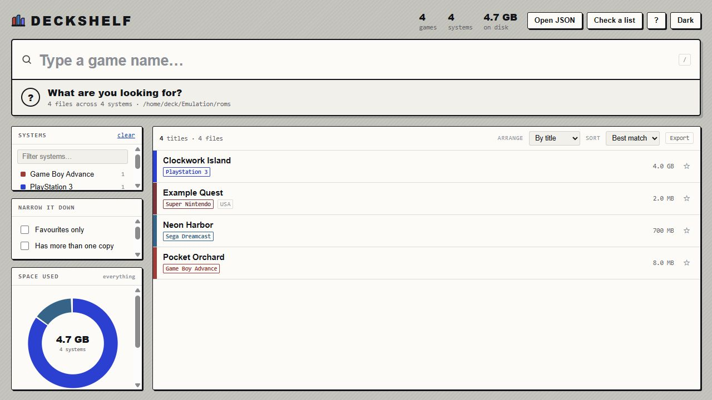

# DeckShelf

<p align="center">
  
</p>

<p align="center">
  A fast, private, portable catalogue for the games you already manage.
</p>

<p align="center">
  <a href="https://github.com/xEnakil/DeckShelf/actions/workflows/ci.yml"></a>
  <a href="https://github.com/xEnakil/DeckShelf/actions/workflows/pages.yml"></a>
  <a href="https://github.com/xEnakil/DeckShelf/releases/latest"></a>
  
  <a href="LICENSE"></a>
</p>

<table align="center">
  <tr>
    <td align="center">
      <sub><strong>Use DeckShelf</strong></sub><br>
      <a href="https://xenakil.github.io/DeckShelf/"></a>
      <a href="https://github.com/xEnakil/DeckShelf/releases/latest"></a>
      <a href="https://github.com/xEnakil/DeckShelf/issues"></a>
    </td>
    <td align="center">
      <sub><strong>Support</strong></sub><br>
      <a href="https://ko-fi.com/xenakil"></a>
      <a href="https://www.paypal.com/paypalme/ElminMughalov"></a>
    </td>
  </tr>
</table>

DeckShelf scans the ROM folders you already manage and turns them into a searchable offline library. It does not include an emulator, download games, launch games, or upload your library.

The same interface ships as a small Rust desktop application and a self-contained HTML file. There is no Electron runtime, account, server, telemetry, installer, or cloud dependency.

## Highlights

- Fast title search with punctuation-insensitive matching, terms in any order, and typo suggestions.
- Filters such as `sys:snes`, `region:japan`, `ext:chd`, and `fav:`.
- System, region, storage, duplicate, favourite, and recent-search views.
- A wanted-list checker, text export, storage breakdowns, and duplicate-title collapsing.
- EmuDeck and RetroDECK-aware scanning with safety filters for metadata, saves, artwork, and disc tracks.
- A portable desktop shell whose settings and cache remain beside the executable.
- One shared interface across Windows, macOS, Linux, Steam Deck, and the web.

## Download

Open the [latest release](https://github.com/xEnakil/DeckShelf/releases/latest) and choose your platform:

| Platform | Native engine | Release files |
|---|---|---|
| Windows 10/11 x64 | WebView2 | `DeckShelf-1.0.0-windows-x64.exe` or `.zip` |
| macOS Apple Silicon | WKWebView | `DeckShelf-1.0.0-macos-arm64` or `.zip` |
| macOS Intel | WKWebView | `DeckShelf-1.0.0-macos-x64` or `.zip` |
| Linux x64 | WebKitGTK 4.1 | `DeckShelf-1.0.0-linux-x64` or `.zip` |
| Any modern browser | Browser engine | [Open the hosted web version](https://xenakil.github.io/DeckShelf/) |

Published desktop builds are currently unsigned. Every release includes SHA-256 checksums and GitHub build-provenance attestations.

## Quick Start

### 1. Build the library index

In Steam Deck Desktop Mode, keep `generate-library.sh`, `library-template.html`, and `assets` together, then run:

```bash
chmod +x generate-library.sh
./generate-library.sh --json-only
```

The scanner detects common EmuDeck and RetroDECK locations. You can also provide a path:

```bash
./generate-library.sh --roms /run/media/deck/SDCARD/Emulation/roms --json-only
```

### 2. Open DeckShelf

Place the generated `library.json` beside the desktop app and launch it. You can also pass a JSON path as the first command-line argument. Replace `library.json` and refresh after rescanning.

Windows preferences and WebView data stay portable in `deckshelf-settings.json` and `deckshelf-cache` beside the executable. Linux requires the system WebKitGTK 4.1 package.

### Browser-only mode

The [hosted web version](https://xenakil.github.io/DeckShelf/) opens with a fictional sample library. Drop your own `library.json` onto the page to browse it locally; the file is never uploaded.

For a fully offline copy, run:

```bash
./generate-library.sh
```

This writes `DeckShelf.html` plus small launchers for Linux, Windows, and macOS. The generated page embeds the library and works without a server.

## Scanner Options

```text
-r, --roms DIR       folder to scan
-o, --out FILE       output HTML path (default: DeckShelf.html)
-t, --template FILE  template to use
-s, --systems FILE   scan only systems listed in a file, one per line
-n, --name NAME      app and output name (default: DeckShelf)
-x, --exclude NAME   ignore a file or folder name; repeat as needed
    --no-launchers   create HTML without platform launchers
    --json-only      write library.json without HTML
    --all            keep files the normal safety filters skip
```

Folder-based systems such as PS3, Wii U, DOS, ports, and ScummVM are counted one top-level folder at a time. Use repeated `--exclude` flags for setup-specific clutter or `--all` to keep every entry.

## Privacy and Safety

- Scanning and search run locally.
- The web version has no backend and does not transmit your library.
- No game files are copied, moved, renamed, deleted, downloaded, or launched.
- Personal libraries, preferences, caches, generated pages, and binaries are ignored by Git.
- The checked-in sample library is fictional.

## Native Design

The desktop shell uses [Wry](https://github.com/tauri-apps/wry) and [Tao](https://github.com/tauri-apps/tao). It embeds `library-template.html` and adds only four native responsibilities:

1. Own the window, taskbar entry, and icon.
2. Load and validate `library.json`.
3. Persist an allowlisted set of preferences beside the executable.
4. Host the page through a private custom protocol with a restrictive content-security policy.

Release builds use optimization level 3, thin LTO, one code-generation unit, stripped symbols, and abort-on-panic. The Windows target statically links its C runtime and is checked for Visual C++ redistributable imports.

## Development

Install Rust 1.97.1 or let `rustup` use the checked-in toolchain. Windows needs Visual Studio Build Tools, macOS needs Xcode Command Line Tools, and Debian/Ubuntu need WebKitGTK headers:

```bash
sudo apt install libwebkit2gtk-4.1-dev
```

Run the validation suite:

```bash
cargo fmt --all -- --check
cargo test --locked --all-targets
cargo clippy --locked --all-targets -- -D warnings
cargo build --locked --release
./tests/test-generator.sh
```

## Releases and Versioning

DeckShelf follows [Semantic Versioning](https://semver.org/) and Conventional Commits. Release Please keeps the changelog and Cargo version synchronized through an automatically maintained release pull request:

- `fix:` produces a patch release, such as `1.0.1`.
- `feat:` produces a minor release, such as `1.1.0`.
- `feat!:` or a `BREAKING CHANGE:` footer produces a major release, such as `2.0.0`.
- `docs:`, `test:`, `ci:`, `build:`, and `chore:` improve the project without forcing a release.

When the release pull request is merged, GitHub builds Windows, Linux, macOS Apple Silicon, and macOS Intel artifacts, publishes checksums, and records provenance. See [CHANGELOG.md](CHANGELOG.md) for release notes.

## Project Structure

```text
src/                       Rust native shell and portable storage
assets/                    application icons and README preview
scripts/                   web, release, and Windows verification helpers
tests/                     scanner regression tests
generate-library.sh        Steam Deck and Linux scanner
library-template.html      shared desktop and browser interface
examples/library.sample.json
```

## Support the Project

If DeckShelf saves you time, support is appreciated but never expected.

<p>
  <a href="https://ko-fi.com/xenakil"></a>
  <a href="https://www.paypal.com/paypalme/ElminMughalov"></a>
</p>

## Issues and Feedback

Use the public [issue tracker](https://github.com/xEnakil/DeckShelf/issues) for reproducible bugs and focused feature requests. Report security problems through GitHub's [private advisory form](https://github.com/xEnakil/DeckShelf/security/advisories/new).

`@xEnakil` is the sole maintainer and project decision-maker.

## License

DeckShelf is available under the [MIT License](LICENSE). Third-party dependency information is recorded in [THIRD_PARTY_NOTICES.txt](THIRD_PARTY_NOTICES.txt) and `Cargo.lock`.
